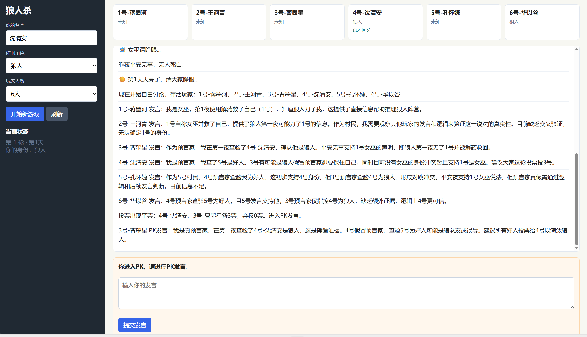
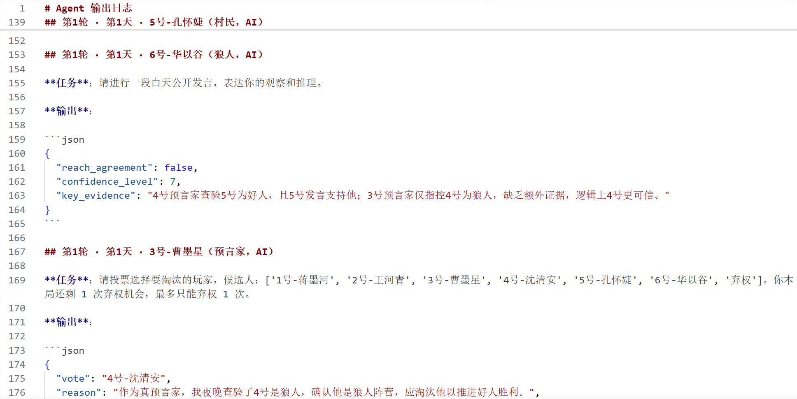
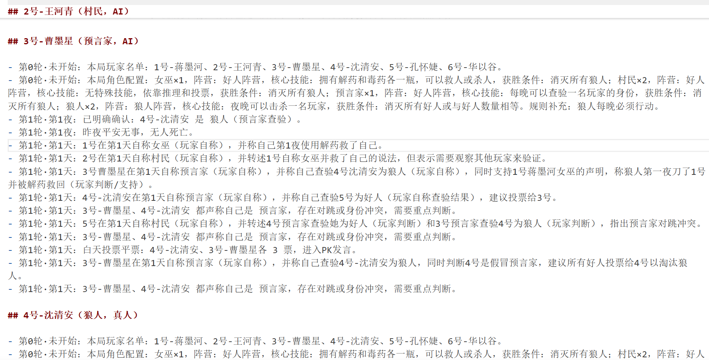

# 基于 LlamaIndex LLM 接口与自定义 Agent 编排，实现多角色狼人杀 Agent 应用

这是一个中文版狼人杀项目，使用 LlamaIndex 调用 OpenAI-compatible 大模型来驱动 AI 玩家，并提供一个 Flask 可视化页面让真人玩家加入游戏。

项目保留了传统狼人杀的角色定义和基础玩法：狼人、预言家、女巫、猎人、村民、守护者等角色定义仍在 `game_roles.py` 中；夜晚行动、白天讨论、投票淘汰和胜负判断由 `main_cn.py` 管理。

## 功能

- AI 玩家由 LlamaIndex 驱动。
- 真人玩家可以选择任意角色加入。
- 支持 6、8、9 人配置。
- 使用 Pydantic 检查 AI 的结构化输出。
- AI 输出失败时会自动使用兜底动作，避免游戏中断。
- Flask 页面展示玩家状态、游戏日志和真人操作表单。
- 游戏结束后前端显示复盘，按时间顺序列出生死事件。

### 效果截图







## 文件说明

- `app.py`：Flask 前端入口。
- `main_cn.py`：LlamaIndex 版狼人杀核心流程。
- `game_roles.py`：传统狼人杀角色定义和人数配置。
- `prompt_cn.py`：中文角色提示词。
- `structured_output_cn.py`：Pydantic 结构化输出模型。
- `utils_cn.py`：投票、胜负判断、日志消息等工具函数。
- `.env`：本地模型 API 配置。

## 总体实现思路

项目采用“游戏引擎 + Agent 代理 + Web 交互层”的结构。

`main_cn.py` 中的 `WerewolfGame` 是游戏引擎，负责创建玩家、分配角色、推进夜晚和白天阶段、统计投票、处理死亡、判断胜负。它不直接依赖前端，因此既可以被 Flask 页面调用，也可以用命令行做简单流程测试。

`WolfPlayer` 是玩家状态对象，保存姓名、身份、是否真人、当前记忆等信息。AI 玩家和真人玩家都使用这个统一结构，只是在需要行动时，AI 玩家交给 LlamaIndex 调用大模型，真人玩家则暂停游戏并等待前端提交。只是类名叫“Wolf”，其实是所有职业的类。

`LlamaIndexAgent` 是 AI 代理层，负责把当前任务、角色提示词、最近游戏记录和 Pydantic schema 组合成 prompt，通过 LlamaIndex 的 `OpenAILike` 模型接口调用兼容 OpenAI API 的大模型，然后把模型输出解析成 JSON，再交给 Pydantic 校验。

`app.py` 是简易 Flask 前端，负责展示玩家状态、公开日志、真人私密日志，以及在真人需要行动时生成表单。前端通过 `/api/start`、`/api/state`、`/api/action` 三个接口和游戏引擎交互。

AI 玩家不会使用“玩家1、玩家2”这类占位名。每局开始时，系统会为 AI 玩家随机生成一个 3 个中文字符的游戏名，并避开真人玩家名。进入游戏后，所有玩家都会统一获得座位号前缀，例如 `1号-郑青行`、`2号-吕扬墨`。创建玩家时，系统会把“你的游戏名是：n号-xxx”写入该玩家的短期记忆，让它在后续发言、投票和夜晚行动中记住自己的名字。

角色和座位是分开随机的。真人玩家的位置每局随机；如果真人选择了某个职业，该职业会分配给真人随机到的座位，其余职业再随机分配到其他座位。

## 按代码看的完整执行流程

### 1. Web 启动和入口

运行：

```bash
python app.py
```

会进入 `app.py` 最底部：

```python
app.run(host="127.0.0.1", port=5000, debug=True)
```

Flask 页面打开后，用户点击“开始新游戏”，前端调用：

```text
POST /api/start
```

后端入口是 `app.py`：

```python
@app.post("/api/start")
def start():
    game = WerewolfGame(...)
    game.step_until_input_or_end()
    return jsonify(game.snapshot())
```

这里创建了一个全局 `game` 对象。后续页面所有操作都围绕这个 `game` 对象继续推进。

### 2. 游戏对象创建

`WerewolfGame.__init__()` 会初始化整局游戏需要的状态：

- `players`：所有玩家对象，key 是玩家名。
- `agents`：AI 玩家名到 `LlamaIndexAgent` 的映射。
- `roles`：玩家名到身份的映射。
- `alive_players`：当前存活玩家。
- `werewolves/seer/witch/hunter/villagers`：按身份分组。
- `log/public_log`：日志。
- `pending_action`：是否正在等待真人输入。
- `pending_ai_vote_futures`：白天并发投票的 future。
- `memory/long_term_memory`：保存在每个 `WolfPlayer` 上。
- `llm`：通过 `build_llm()` 创建的 LlamaIndex `OpenAILike` 模型对象。

模型创建链路是：

```python
WerewolfGame.__init__()
  -> build_llm()
  -> OpenAILike(...)
```

`build_llm()` 读取当前目录 `.env` 中的：

```env
LLM_API_KEY
LLM_MODEL_ID
LLM_BASE_URL
```

所以所有 AI 行动和长期记忆摘要都使用同一个 LlamaIndex LLM 配置。

### 3. 玩家和 Agent 创建

第一次调用 `step_until_input_or_end()` 时，如果还没有玩家，会先执行：

```python
self.setup_game()
```

`setup_game()` 做这些事：

1. 从 `GameRoles.get_standard_setup(player_count)` 拿本局角色列表。
2. 随机真人玩家座位。
3. 如果真人选择了角色，把该角色放到真人随机座位。
4. 其他角色随机分配到剩余座位。
5. 给 AI 生成随机中文名。
6. 给所有玩家加座位号前缀，例如 `1号-郑青行`。
7. 为每个玩家创建 `WolfPlayer`。
8. 如果不是真人，再创建对应的 `LlamaIndexAgent`：

```python
self.agents[name] = LlamaIndexAgent(player, self.llm)
```

所以当前每个 AI 玩家有两个对象：

- `WolfPlayer`：保存状态、身份、短期记忆、长期记忆。
- `LlamaIndexAgent`：负责把这个玩家的状态组织成 prompt 并调用 LLM。

真人玩家只有 `WolfPlayer`，没有 `LlamaIndexAgent`，因为真人行动来自前端表单。

### 4. Agent 的生命周期

当前项目里的 Agent 生命周期是局内生命周期：

1. 开局 `setup_game()` 创建 AI 玩家的 `WolfPlayer` 和 `LlamaIndexAgent`。
2. 整局游戏中，每次轮到该 AI 行动，就通过 `_ask_ai()` 调用它。
   1. 每一次调用 `_ask_ai()` 都会根据当前 task 组织 prompt，并且返回符合当前角色和格式的输出。
   2. 在“狼人讨论、狼人选择刀谁、预言家预言、女巫用药、白天正常发言、投票选人、白天因同票数最高而PK辩护自己发言、猎人开枪”这9种情况下会调用 `_ask_ai()`。
3. Agent 每次行动都会读取该玩家当前短期记忆和长期记忆。
4. Agent 输出经过 Pydantic 校验后交还给游戏引擎。
5. 游戏结束或新开一局时，旧的内存对象自然失效。

Agent 本身不会自己循环运行，也不会主动决定下一步该做什么。它是被 `WerewolfGame` 在具体阶段中调用的。

当前没有官方框架里的：

```python
agent.run(task)
```

最接近 `agent.run()` 的调用是 `WerewolfGame._ask_ai()`：

```python
def _ask_ai(self, player, task, model_cls, fallback):
    msg = self.agents[player.name].ask_structured(task, model_cls, fallback)
    self.write_agent_msg(player, task, msg.metadata, source="AI")
    return msg
```

这相当于：

```text
让某个 AI 玩家针对某个任务运行一次
```

再往下一层是：

```python
LlamaIndexAgent.ask_structured()
```

它负责：

1. 调用 `_build_prompt()`。
2. 把角色提示词、短期记忆、长期记忆、当前任务、Pydantic schema 拼成 prompt。
3. 调用：

```python
self.llm.chat(...)
```

4. 从模型回复中提取 JSON。
5. 用 Pydantic `model_validate()` 校验。
6. 返回 `SimpleMessage`，其中 `metadata` 是结构化结果。

所以真实调用链是：

```text
WerewolfGame 某个阶段
  -> _ask_ai(player, task, model_cls, fallback)
  -> LlamaIndexAgent.ask_structured(...)
  -> LlamaIndexAgent._build_prompt(...)
  -> self.llm.chat(...)
  -> _extract_json(...)
  -> model_cls.model_validate(...)
  -> SimpleMessage(metadata=...)
```

### 5. 和官方 Agent 框架的异同

当前项目不是 LlamaIndex 官方 `FunctionAgent`、`ReActAgent` 或 `AgentWorkflow`。

当前实现是：

```text
自定义游戏 Agent 层 + LlamaIndex OpenAILike LLM 调用 + Pydantic 输出校验
```

它和官方 `FunctionAgent` 的相同点：

- 都会把任务交给 LLM。
- 都可以围绕 prompt、上下文、工具/结构化结果组织一次推理。
- 都可以把一次 LLM 调用看作“Agent 执行一步”。

不同点：

- 官方 `FunctionAgent` 通常有工具调用、函数选择和多步工具循环。
- 当前 `LlamaIndexAgent` 没有工具注册，也不会自动选择工具。
- 官方 Agent 通常由 `agent.run()` 驱动任务。
- 当前 Agent 由狼人杀游戏引擎在固定阶段调用 `_ask_ai()`。
- 官方 Agent 的流程控制在 Agent 框架里。
- 当前项目的流程控制在 `WerewolfGame` 里。
- 官方 Agent 的 memory 可以接 LlamaIndex 自带组件。
- 当前 memory 是 `WolfPlayer.memory` 和 `WolfPlayer.long_term_memory` 自己维护。

也就是说，当前 Agent 更像“游戏角色决策器”，不是通用工具调用 Agent。

### 6. 整个游戏如何驱动

游戏推进的总入口是：

```python
step_until_input_or_end()
```

它的职责是：

1. 如果没 setup，就先 `setup_game()`。
2. 进入轮次循环。
3. 每轮先 `night_phase()`。
4. 如果夜晚遇到真人要操作，设置 `pending_action` 并返回给前端。
5. 夜晚结束后进入 `day_phase()`。
6. 如果白天遇到真人发言/投票/猎人开枪，设置 `pending_action` 并返回给前端。
7. 如果没有真人阻塞，就继续下一轮，直到胜负或最大轮数。

真人提交操作走：

```text
POST /api/action
  -> game.submit_human_action(payload)
```

`submit_human_action()` 会根据 `pending_action["type"]` 决定继续哪个流程，例如：

- `werewolf_discussion`：真人狼人夜聊后继续狼队协商。
- `seer_check`：真人预言家查验后继续女巫阶段。
- `witch_action`：真人女巫用药后结束夜晚。
- `day_speech`：真人白天发言后继续 AI 发言，再进入投票。
- `day_vote`：真人投票后等待 AI 并发投票结束并统一计票。
- `pk_speech`：真人 PK 发言后继续其他 PK 发言。
- `pk_vote`：真人 PK 投票后统一计票。
- `hunter_shot`：真人猎人开枪后结算白天。

### 7. 夜晚流程

夜晚入口是：

```python
night_phase()
```

顺序是：

1. `werewolf_phase()`：狼人夜聊并定刀。
2. `seer_phase()`：预言家查验。
3. `witch_phase()`：女巫决定是否用药。
4. `finish_night()`：结算夜晚死亡、写长期记忆、检查胜负。

如果某个特殊身份是真人玩家，流程不会调用 AI，而是设置 `pending_action` 返回前端。

#### 狼人阶段

`werewolf_phase()` 找出存活狼人：

```python
wolves = self.alive_wolves()
```

如果真人是狼人，设置：

```python
pending_action = {"type": "werewolf_discussion", ...}
```

如果全是 AI 狼人：

```python
run_ai_wolf_discussions(candidates)
resolve_werewolf_kill(candidates)
```

AI 狼人夜聊调用链是：

```text
run_ai_wolf_discussions()
  -> ai_wolf_discussion()
  -> _ask_ai(... DiscussionModelCN ...)
  -> broadcast_wolf_chat()
```

`broadcast_wolf_chat()` 只把夜聊写入狼人短期记忆，不给好人阵营。

最终定刀在：

```python
resolve_werewolf_kill()
```

每个狼人输出 `WerewolfKillModelCN`，系统统计 target，最高票作为狼队统一击杀目标。

并且会总结伪装策略写入长期记忆 `summarize_werewolf_strategy()`。

#### 预言家阶段

`seer_phase()`：

- 真人预言家：设置 `pending_action={"type": "seer_check"}`。
- AI 预言家：调用 `_ask_ai(... get_seer_model_cn(...))`。

查验结果通过 `_record_seer_result()` 写入预言家私密记忆和长期记忆。

#### 女巫阶段

`witch_phase()`：

- 真人女巫：设置 `pending_action={"type": "witch_action"}`。
- AI 女巫：调用 `_ask_ai(... WitchActionModelCN ...)`。

用药结果在 `_apply_witch_action()` 中处理，并写入女巫私密长期记忆。

### 8. 白天流程

白天入口是：

```python
day_phase()
```

顺序是：

1. 公告天亮。
2. 公告自由讨论。
3. 存活玩家按顺序发言。
4. 真人轮到发言时设置 `pending_action={"type": "day_speech"}` 并返回前端。
5. AI 发言调用 `ai_day_speech()`。
6. 发言结束进入 `start_vote()`。

AI 白天发言调用链：

```text
ai_day_speech(player)
  -> _ask_ai(... DiscussionModelCN ...)
  -> announce("某玩家 发言：...")
  -> record_identity_claim(...)
  -> summarize_speech_for_long_term_memory(...)
```

长期记忆摘要调用的是同一个 `self.llm.chat()`，但它不是某个玩家 Agent 的上下文，而是中立记录员式摘要。

### 9. 白天投票、PK 和猎人

投票入口：

```python
start_vote()
```

AI 投票不是逐个等待，而是：

```python
start_ai_day_vote_futures()
```

它使用 `ThreadPoolExecutor` 给每个 AI 玩家提交一个投票任务：

```python
self.vote_executor.submit(self.ask_ai_day_vote, player, candidates)
```

真人投票提交后：

```python
collect_pending_ai_votes()
finish_vote(votes)
```

`finish_vote()` 会：

1. 扣除弃权次数。
2. 排除弃权票。
3. 检查最高票是否并列。
4. 不并列则淘汰最高票。
5. 并列则进入 `start_pk_phase()`。

PK 流程：

```text
start_pk_phase()
  -> PK 玩家发言
  -> start_pk_vote()
  -> finish_vote()
```

如果 PK 重新投票仍平票，则本轮无人出局。

如果被投票出局的是猎人：

```python
hunter_phase(voted_out)
```

真人猎人会进入 `pending_action={"type": "hunter_shot"}`；AI 猎人会调用 `_ask_ai(... get_hunter_model_cn(...))`。

### 10. 前端如何参与流程

前端不会自己计算游戏规则，只负责：

- 发送开始请求。
- 展示 `game.snapshot()`。
- 根据 `pending_action` 渲染表单。
- 把真人输入提交给 `/api/action`。
- 在等待模型调用时轮询 `/api/progress` 显示计时器。

后端状态快照由：

```python
snapshot()
```

返回，其中包括：

- 当前阶段
- 轮次
- 玩家列表
- 真人身份
- 公开日志
- 私密日志
- `pending_action`
- `progress_status`

### 11. 总结一句话

这套代码不是“Agent 自己驱动游戏”，而是：

```text
WerewolfGame 作为游戏引擎驱动流程
  -> 在需要 AI 决策的位置调用 _ask_ai()
  -> _ask_ai() 调用对应 LlamaIndexAgent
  -> LlamaIndexAgent 调用 LlamaIndex 的 llm.chat()
  -> Pydantic 校验结构化结果
  -> WerewolfGame 根据结果更新游戏状态
  -> 如果需要真人输入，就暂停并交给 Flask 前端
```

## Agent 相关技术点

### Agent 角色建模

每个 AI 玩家都可以看作一个独立 Agent。Agent 的身份由 `role` 决定，例如狼人、预言家、女巫、猎人、村民。不同身份会拿到不同的 system prompt，并根据阵营目标做决策。

角色提示词在 `prompt_cn.py` 中维护，包含：

- 当前玩家是谁。
- 当前玩家扮演什么身份。
- 所属阵营和胜利目标。
- 夜晚或白天应该如何行动。
- 必须只返回 JSON 的输出约束。

### 短期记忆

项目实现了短期记忆。每个 `WolfPlayer` 都有一个 `memory` 列表，用来保存最近的游戏记录和该玩家接收到的信息。

当前策略不是固定条数窗口，而是固定保留最近一轮的所有短期事件：

```python
min_round = max(0, current_round - keep_rounds + 1)
if item_round >= min_round:
    trimmed.append(item)
```

短期记忆中会保留最近一轮内的公开公告、广播、玩家发言、狼人夜聊私密消息、预言家/女巫等私密信息。一轮以前的细节不会继续留在短期记忆里，避免 prompt 被历史流水账撑爆。

一轮以前仍然重要的信息会进入长期记忆，例如死亡事件、投票结果、身份声称、矛盾线索和已确认身份。AI 决策时，`LlamaIndexAgent` 会同时读取最近一轮短期记忆和所有长期记忆。

### 长期记忆

项目实现了局内长期记忆。每个 `WolfPlayer` 都有 `long_term_memory` 列表，用来沉淀比短期对话窗口更稳定的关键事实。

长期记忆摘要调用的是同一个 `self.llm.chat()`，但它不是某个玩家 Agent 的上下文，而是中立记录员式摘要。

AI 每次决策时，prompt 会同时包含：

- 最近短期记忆：近期公开消息、私密消息和上下文。
- 长期记忆：关键事件、身份声称、身份矛盾、已确认信息。

当前会写入长期记忆的内容包括：

- 本局玩家名单。
- 本局角色配置，包括每个角色数量、所属阵营、核心技能和获胜条件；规则摘要会额外标注“狼人每晚必须行动”。
- 本局所有玩家的游戏名。
- 每晚死亡情况，例如“第 1 晚谁死亡”。
- 白天投票结果，例如“谁以几票被淘汰”。
- 每轮结束后的存活玩家名单。
- 公开发言中的身份声称和摘要证据，例如“某人在第几天说自己是预言家；证据：他说自己昨晚查验了某人”。
- 公开身份矛盾，例如“多人声称同一个神职”或“同一玩家前后声称多个身份”。
- 私密确定身份，例如预言家的查验结果。
- 女巫私密行动，例如第几夜救了谁、毒了谁、剩余药量。
- 狼人私密行动，例如第几夜狼队夜聊结论、自己最终投票击杀了谁。
- 狼人伪装/配合策略：系统会调用模型从狼队 `kill_strategy` 和 `team_coordination` 中提取策略，并按每个狼人视角写入私密长期记忆，例如“我伪装成村民，xx号队友负责带节奏”。
- 狼人开局私密信息，例如“我的狼队友是 xx”。

长期记忆不会保存公开发言原话，而是调用模型把发言摘要成具体的局势记忆。摘要 prompt 会要求模型只保留会直接影响游戏走向的信息：身份声称、明确阵营判断、预言家自称查验、女巫自称用药/未用药、猎人开枪计划、明确投票建议、明确点名某人是狼人/好人，并标注“玩家自称”或“玩家判断”。比如不会记录整段“我是女巫，昨晚狼人杀我，我用了救药自救……”，而会记录为“2号在第1天自称女巫（好人阵营，玩家自称），并称自己使用解药自救。”

泛泛推断不会进入长期记忆事实摘要。例如“平安夜可能是女巫救人”“信息有限”“建议继续讨论”“先听大家发言”这类没有明确身份、阵营、技能操作或投票对象的信息，会被视为无有效信息，并且不会写入长期记忆。

长期记忆遵守信息可见性：

- 公开事件会写入所有玩家的长期记忆。
- 狼人夜聊仍只写入狼人短期记忆，不会写给好人阵营。
- 狼队友名单开局只写入狼人自己的私密长期记忆。
- 预言家查验结果只写入对应预言家的长期记忆，不会泄露给其他玩家。
- 女巫用药记录只写入女巫自己的长期记忆，不会泄露给其他玩家。
- 狼队夜聊结论只写入狼人长期记忆；每个狼人自己的最终定刀投票只写给对应狼人自己。
- 玩家真实身份不会因为死亡自动公开写入长期记忆，避免改变原有玩法。

项目还会实时刷新 `longterm_memory.md`，用于调试和复盘每个玩家当前记住了什么。

目前的长期记忆仍然是局内长期记忆，不是跨局永久记忆。新游戏开始时会重置 `longterm_memory.md`，Python 进程重启后内存中的玩家记忆也会消失。

如果后续要扩展长期记忆，可以考虑：

- 用 LlamaIndex VectorStore 保存每局关键事件。
- 给每个玩家维护长期画像，例如“经常悍跳”“投票激进”“偏保守”。
- 在每次发言或投票前，从长期记忆中检索相关历史。
- 把游戏日志落盘，下一局重新加载。

### 消息传递

核心方式是：

- `WerewolfGame.announce()` 发布公开消息。
- 公开消息会写入 `public_log`，并广播给所有玩家的短期记忆。
- 私密信息只写入对应玩家的 `memory`，例如预言家的查验结果、真人玩家的身份提示。
- 狼人夜聊使用私密广播：`broadcast_wolf_chat()` 只把狼队发言写入存活狼人的短期记忆，不会进入公开日志，也不会被好人阵营看到。
- Flask 前端只展示公开日志和真人可见的私密日志。

这种方式更简单，也更适合 Web 页面控制节奏。缺点是没有复杂多 Agent 总线，所有消息路由都由游戏引擎集中管理。

### 狼人之间如何协商

狼人夜晚不是“每个狼人各自推理若干次后直接投票”，而是“共享夜聊记忆 + 最终统一定刀”。

AI 狼人的协商流程在 `main_cn.py` 中由这些方法组成：

- `run_ai_wolf_discussions()`：推进多轮 AI 狼人夜聊。
- `ai_wolf_discussion()`：让某个 AI 狼人基于已有狼队记忆发言。
- `broadcast_wolf_chat()`：把该狼人的夜聊发言广播到所有存活狼人的短期记忆。
- `resolve_werewolf_kill()`：所有狼人基于共享夜聊记忆给出最终击杀票，再用多数票形成统一击杀目标。

每个 AI 狼人发言时会看到自己最近的 `memory`，其中包含上一轮狼队友的夜聊内容。因此狼人 A 的意见会影响狼人 B，狼人 B 的回应也会影响后续狼人和最终定刀。

`DiscussionModelCN.reach_agreement` 表示该狼人认为当前夜聊是否已接近共识。系统会统计本轮 AI 狼人中有多少人认为达成一致，如果多数 AI 狼人都认为已经达成一致，就提前结束夜聊，进入最终定刀；否则最多讨论 `MAX_DISCUSSION_ROUND` 轮。

最终定刀不是直接取某一个 Agent 的建议，而是：

1. 每个狼人基于共享夜聊记忆输出 `WerewolfKillModelCN`。
2. 真人狼人如果存在，也会提交自己的建议目标。
3. 系统用 `majority_vote_cn()` 统计狼队最终击杀票。
4. 得票最多的目标成为狼队统一击杀对象。

### 真人狼人如何参与狼队协商

如果真人玩家选择狼人，夜晚不会直接进入“选一个目标击杀”的简单表单，而是进入狼人夜聊表单。

真人狼人需要提交：

- 夜聊策略文本：例如为什么想刀某个人，白天准备如何伪装。
- 建议击杀目标。

提交后，系统会：

1. 把真人狼人的夜聊内容通过 `broadcast_wolf_chat()` 写入所有狼人短期记忆。
2. 让 AI 狼人基于真人狼人的意见继续夜聊。
3. 让 AI 狼人和真人狼人一起进入最终定刀。
4. 用多数票形成狼队统一击杀目标。

因此真人狼人不是旁路操作，而是狼队协商链路的一部分。

### 结构化输出

项目使用 Pydantic 做结构化输出校验，模型定义在 `structured_output_cn.py` 中。

例如：

- `DiscussionModelCN`：白天讨论或狼人内部讨论。
- `WerewolfKillModelCN`：狼人夜晚击杀。
- `WitchActionModelCN`：女巫是否用药。
- `SeerModelCN`：预言家查验。
- `HunterModelCN`：猎人是否开枪。
- `VoteModelCN`：白天投票。

AI 回复必须是 JSON，代码会先解析 JSON，再使用 `model_validate()` 校验字段、类型和候选值。动态候选人使用 `Literal` 约束，避免模型投给不存在的玩家。

### 容错处理

大模型可能输出无效 JSON、字段缺失、候选人错误或格式不符合 Pydantic schema。项目在 `LlamaIndexAgent.ask_structured()` 中集中处理这些异常。

如果解析或校验失败，会打印警告，并使用兜底动作继续游戏，例如：

- 随机选择一个合法击杀目标。
- 随机选择一个合法投票目标。
- 女巫默认谨慎使用药。
- 猎人可能随机选择是否开枪。

这样可以避免一次模型输出错误导致整局游戏崩掉。

### 人类参与方式

真人玩家也是 `WolfPlayer`。区别在于 `is_human=True`。

当流程走到真人需要行动的位置时，游戏不会继续调用模型，而是设置 `pending_action`，前端读取这个状态并渲染对应表单。真人提交后，`/api/action` 调用 `submit_human_action()`，游戏继续向后推进，直到下一次需要真人输入或游戏结束。

这种实现方式让真人可以扮演任意角色，包括狼人、预言家、女巫、猎人或村民。

开局时系统只公开广播本局玩家名单。所有 AI Agent 会通过玩家名单知道有哪些游戏名参与本局，但不会知道哪个玩家是真人。

### 白天讨论和异步投票

白天讨论是公开消息传递。真人玩家提交白天发言后，系统会通过 `announce()` 把这段发言写入公开日志，并广播给所有存活玩家的短期记忆。因此后续 AI Agent 发言和投票时可以看到真人玩家刚才说了什么。

白天投票采用“并发收集、统一计票”的方式：

1. 进入投票阶段时，系统会用 `ThreadPoolExecutor` 同时发起所有 AI 玩家的投票任务。
2. 如果真人玩家仍然存活，前端会立刻显示投票表单；AI 投票在后台并发进行。
3. AI 投票结果暂存在 `pending_ai_vote_futures` / `pending_ai_votes` 中，不会提前公布。
4. 真人投票提交后，系统等待尚未完成的 AI 投票任务，合并真人票和 AI 票。
5. `majority_vote_cn()` 对所有票统一计票并公布结果。

这样实现后，AI 和真人是在同一投票阶段并发进行投票。AI 不会等真人投完以后才投票，也不会根据真人投票结果临时改变选择。

白天投票支持弃权。每个玩家本局最多只能弃权 1 次；前端会显示真人玩家“弃权机会剩余：0/1 次”。AI 玩家在仍有弃权机会时，也会在投票候选中看到“弃权”。弃权票不会成为淘汰目标，如果本轮没有任何有效淘汰票，则无人出局。

如果白天投票最高票并列，并列玩家会进入 PK 发言。PK 发言结束后，所有存活玩家只在并列玩家中重新投票。若 PK 重新投票仍然最高票并列，则本轮无人出局，避免无限循环。

这里的并发使用的是 `ThreadPoolExecutor`，也就是多线程并发，适合把多个同步 LLM API 调用同时发出去。它和 `asyncio` 的区别是：`asyncio` 是单线程事件循环，需要底层调用链提供 `async/await` 的非阻塞接口；当前 LlamaIndex/OpenAI-like 调用在本项目中按同步方法使用，所以用线程池更直接。如果模型客户端改成原生 async 接口，也可以改用 `asyncio.gather()` 来并发投票。

### 前端与后端状态同步

Flask 后端在内存中保存一个全局 `game` 对象。前端不保存复杂状态，只通过接口读取后端快照。

主要接口：

- `POST /api/start`：创建新游戏。
- `GET /api/state`：获取当前游戏快照。
- `POST /api/action`：提交真人行动。

快照中包含当前阶段、轮次、玩家状态、真人身份、公开日志、私密日志和待处理动作。
游戏结束后，快照还会返回 `review_events`，前端据此展示复盘，包括狼人刀人、女巫用药、白天投票出局和猎人带人。

如果真人玩家是狼人，前端玩家状态会把狼队友的身份显示为“狼人”；其他阵营玩家仍显示为“未知”，避免额外泄露身份。

## 安装依赖

建议在虚拟环境中安装：

```bash
pip install flask pydantic llama-index llama-index-llms-openai-like python-dotenv
```

如果没有安装 `python-dotenv`，项目也会尝试用内置兜底方式读取当前目录下的 `.env`。

## 环境变量

项目会读取 `wolves/.env`，需要至少配置：

```env
LLM_API_KEY="你的 API Key"
LLM_MODEL_ID="你的模型名"
LLM_BASE_URL="OpenAI-compatible 接口地址"
```

也可以使用 `OPENAI_API_KEY` 作为备用 API Key。

## 启动前端

在 `wolves` 目录运行：

```bash
python app.py
```

然后打开：

```text
http://127.0.0.1:5000
```

页面中可以选择：

- 你的名字
- 你的角色
- 玩家人数

点击“开始新游戏”后，游戏会自动运行到需要真人操作的位置。

## 真人玩家操作

根据你的角色和游戏阶段，页面会出现不同操作：

- 狼人：夜晚选择击杀目标。
- 预言家：夜晚选择查验目标。
- 女巫：夜晚选择是否使用解药或毒药。
- 村民/其他好人：白天发言和投票。
- 猎人：被投票出局时选择是否开枪。

真人玩家的身份和查验结果会显示在私密日志中，其他公开事件显示在普通日志中。

如果真人玩家是狼人，前端私密日志会显示狼队夜聊内容、每个狼人当晚最终定刀意见，以及狼队最终决定击杀的玩家。如果真人玩家是女巫，前端私密日志会显示当晚是否用药、救了谁、毒了谁和剩余药量。

女巫可以选择自己作为解药或毒药目标；如果夜晚被击杀的是女巫自己，前端仍允许使用解药自救。

狼人夜晚可以选择“空刀”。空刀属于狼人夜晚行动的一种，表示当晚不击杀任何人，后续女巫会收到“今晚平安无事”。

当夜晚私密角色正在行动且真人玩家不是该角色时，前端会显示等待计时器，例如“狼人/预言家/女巫正在操作中，12秒”。白天等待 AI 发言或投票时，也会显示“x号玩家发言中，12秒”或“其他玩家投票中，12秒”，避免模型调用耗时时误以为页面卡住。

## 命令行快速运行

也可以直接运行核心文件做简单命令行测试：

```bash
python main_cn.py
```

命令行模式主要用于快速验证流程，完整交互建议使用 Flask 页面。

## 可能的面试环节

### 开发过程中遇到的问题和解决方法

- 角色名不统一、agent不知道用户叫什么
  - 在游戏开始加入长期记忆。
- 每个agent记不住自己的职业或被伪装策略混淆
  - WolfPlayer 里保存了角色，每次调用 LLM 时都会把角色写进 system prompt。
- 短期记忆太长
  - 短期记忆只记录最近两轮的所有信息，事件、关键角色操作、自称职业等全部摘要进长期记忆。
- 平票
  - 再重新发言并投票pk（算同一轮短期记忆，只有进入新的夜晚才算下一轮）。
- 没用llamaindex的functionagent
  - 只用了它的openailike接口，原因是官方框架太重了，没那么适配。并且输出控制用pydantic校验。
- 各个agent投票过程太慢
  - 用并发。用 ThreadPoolExecutor 而不是 asyncio，原因：LLM 调用是同步的，不需要重写整个 Flask/game 流程为 async（如FastAPI/Quart框架），适合多个独立 LLM API 请求同时发出。
- 确认用户发言中有“大家相信我”、“我是真的xx（身份）”不会过多影响 Agent 的判断。
- 用户玩家作为狼人玩家的话看不到狼人队友的讨论
  - self.log 的 【私密】... 通道：真人狼人能看到狼队夜聊、队友最终定刀票和狼队统一击杀目标。该通道中还有用户作为女巫的用药信息和作为预言家的查验结果。

### 项目中的 Agent 应用能力

- 多 Agent 角色建模
  - `WolfPlayer` 保存身份/状态，`LlamaIndexAgent` 按角色 system prompt 调用 LLM
- 私密/公开消息传递（核心就是：选择给哪个 WolfPlayer 对象写入记忆。）
  - `announce()` 广播公开消息，`broadcast_wolf_chat()` 和 `remember_private_event()` 隔离私密信息
    - `announce()`做的事：所有的log的内容保存至self.log，然后判断是否public，若是，则通过`observe()`把这条公开消息写进每个玩家的短期记忆。`observe()`负责写入短期记忆和判断短期记忆是否超轮。公开短期：遍历所有玩家observe；狼队私密短期：只写给狼人列表observe；私密短期：只写给某一个玩家observe。`broadcast_wolf_chat()` 只给当前活着的狼人对象 `observe()`，所以狼人夜聊只进入狼人玩家的短期记忆。如果真人玩家也是狼人，还会额外写一条前端私密日志。
    - `remember_private_event()` 只接收一个明确的 `player` 对象，它只负责“把内容写进这个玩家的长期记忆”。私密长期记忆的隔离同样靠的是调用方选对 `player` 对象，而不是 `remember_private_event()` 自己按 role 判断。公开的长期记忆则是通过 `remember_public_event()` 遍历所有玩家。
- 短期记忆和长期记忆设计
  - `memory` 保留最近一轮，`long_term_memory` 通过 LLM 摘要玩家发言保存关键事件/身份线索/私密技能结果
    - 长期记忆中，“事件”类都是代码直接写的，不经过LLM摘要；公开发言会先让 LLM 判断有没有有效信息，并生成摘要，有效才写入长期记忆。
    - 白天公开发言通过 `record_identity_claim()` 提取摘要（通过`llm.chat`）并记录公开发言中身份声称和冲突线索（作为关键线索）。
- 人类参与 Agent 流程
  - `pending_action` 暂停游戏，Flask 表单收集真人发言、投票和夜晚技能
- Pydantic 结构化输出
  - `structured_output_cn.py` 定义行动 schema，`model_validate()` 校验 LLM JSON
- LLM 输出容错
  - `ask_structured()` 捕获解析/校验异常，并用 fallback 行动继续游戏
- 多阶段状态机
  - `step_until_input_or_end()` 串联夜晚、白天、投票、PK、猎人和胜负结算
- 并发投票
  - `ThreadPoolExecutor` 并发提交 AI 投票，真人票提交后统一计票
- 前端可视化交互
  - Flask 提供 `/api/start`、`/api/state`、`/api/action`，页面渲染日志、状态和操作表单

### 当前架构限制

- 游戏状态保存在 Flask 进程内，刷新页面不丢，但重启服务会丢。
- 没有数据库、用户登录、多房间或多人在线同步。
- AI 玩家之间不是并发执行，而是由游戏引擎按阶段顺序调用；狼人夜聊通过共享短期记忆实现顺序式协商。
- Agent 不是自主循环，而是游戏引擎驱动。
- 消息传递是集中式路由，不是完全去中心化 Agent 通信。
- 没有复杂工具规划和 tool calling。
